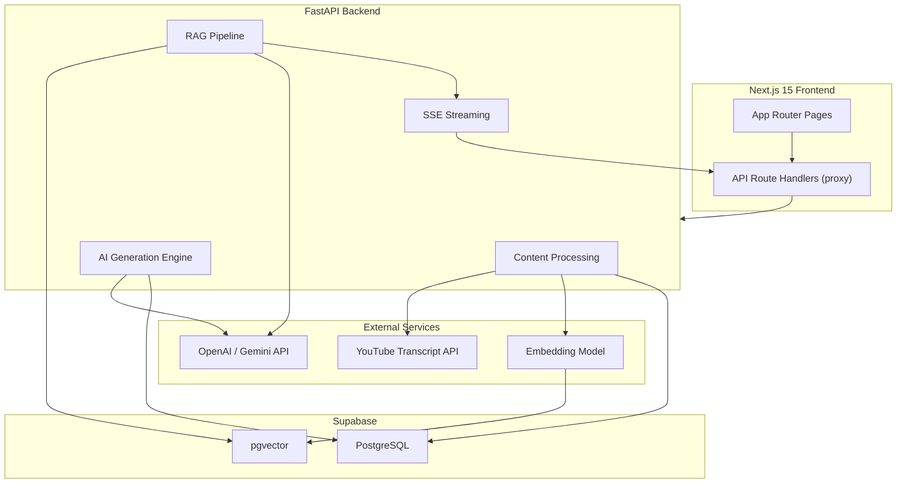

# AI Learning Assistant — Implementation Plan

An AI-powered learning platform where users input a YouTube URL or upload a PDF. The system processes content, generates flashcards & quizzes, and enables RAG-powered contextual chat — all wrapped in a polished, responsive UI.

---

## System Architecture



---

## User Review Required

> [!IMPORTANT]
> **AI Model Choice**: The plan uses **OpenAI (GPT-4.1 + text-embedding-3-small)** as the primary AI provider. If you prefer **Gemini**, I can swap out the integration — the architecture supports both via an abstraction layer. Please confirm your preference and provide the API key you'd like to use.

> [!IMPORTANT]
> **Database**: The plan uses **Supabase** (hosted PostgreSQL + pgvector). You'll need a Supabase project URL and anon/service key. If you prefer a local Postgres instance with pgvector, let me know.

> [!WARNING]
> **API Keys Required**: Before execution, you'll need to provide:
> - OpenAI API key (or Gemini API key)
> - Supabase project URL + service role key

---

## Project Directory Structure

```
c:\Assigment\Learning Platform\
├── frontend/                          # Next.js 15 App
│   ├── public/
│   ├── src/
│   │   ├── app/
│   │   │   ├── layout.tsx             # Root layout with sidebar
│   │   │   ├── page.tsx               # Home / Upload page
│   │   │   ├── globals.css            # TailwindCSS globals
│   │   │   ├── library/
│   │   │   │   └── page.tsx           # Content library
│   │   │   ├── study/[id]/
│   │   │   │   ├── page.tsx           # Study dashboard per content
│   │   │   │   ├── flashcards/
│   │   │   │   │   └── page.tsx       # Flashcard viewer
│   │   │   │   ├── quiz/
│   │   │   │   │   └── page.tsx       # Quiz interface
│   │   │   │   └── chat/
│   │   │   │       └── page.tsx       # RAG chat interface
│   │   │   └── api/                   # Next.js API route proxies
│   │   │       ├── process-video/route.ts
│   │   │       ├── process-pdf/route.ts
│   │   │       ├── generate-flashcards/route.ts
│   │   │       ├── generate-quiz/route.ts
│   │   │       └── chat/route.ts
│   │   ├── components/
│   │   │   ├── ui/                    # Reusable UI primitives
│   │   │   ├── layout/               # Shell, Sidebar, Header
│   │   │   ├── upload/               # Upload form components
│   │   │   ├── flashcard/            # Flashcard viewer
│   │   │   ├── quiz/                 # Quiz components
│   │   │   └── chat/                 # Chat components
│   │   ├── lib/
│   │   │   ├── api.ts                # API client
│   │   │   └── utils.ts              # Utility functions
│   │   └── types/
│   │       └── index.ts              # Shared TypeScript types
│   ├── tailwind.config.ts
│   ├── next.config.mjs
│   ├── tsconfig.json
│   └── package.json
│
├── backend/                           # FastAPI Backend
│   ├── app/
│   │   ├── main.py                   # FastAPI app entry point
│   │   ├── config.py                 # Settings & env config
│   │   ├── database.py               # Supabase client setup
│   │   ├── models/
│   │   │   ├── schemas.py            # Pydantic request/response schemas
│   │   │   └── database.py           # DB table models
│   │   ├── routers/
│   │   │   ├── content.py            # /process-video, /process-pdf
│   │   │   ├── flashcards.py         # /generate-flashcards
│   │   │   ├── quiz.py               # /generate-quiz
│   │   │   └── chat.py               # /chat (streaming)
│   │   ├── services/
│   │   │   ├── youtube_service.py    # YouTube transcript extraction
│   │   │   ├── pdf_service.py        # PDF text extraction
│   │   │   ├── chunking_service.py   # Text chunking engine
│   │   │   ├── embedding_service.py  # Embedding generation
│   │   │   ├── vector_store.py       # pgvector operations
│   │   │   ├── ai_service.py         # LLM calls (flashcards, quiz, chat)
│   │   │   └── rag_service.py        # RAG pipeline orchestrator
│   │   └── prompts/
│   │       ├── flashcard_prompt.py   # Flashcard generation prompts
│   │       ├── quiz_prompt.py        # Quiz generation prompts
│   │       └── chat_prompt.py        # RAG chat system prompts
│   ├── requirements.txt
│   ├── .env.example
│   └── README.md
│
├── .env.example                       # Root env template
└── README.md                          # Project documentation
```

---

## Proposed Changes

### Component 1: Database Schema (Supabase)

#### [NEW] Database Migration / Setup

Six core tables with pgvector extension:

| Table | Purpose | Key Columns |
|-------|---------|-------------|
| `contents` | Stores processed YouTube/PDF metadata | `id`, `title`, `source_type`, `source_url`, `raw_text`, `status`, `created_at` |
| `chunks` | Text chunks with embeddings | `id`, `content_id`, `chunk_text`, `chunk_index`, `embedding` (vector 1536), `metadata` |
| `flashcards` | Generated flashcard sets | `id`, `content_id`, `front`, `back`, `difficulty`, `order_index` |
| `quizzes` | Quiz question sets | `id`, `content_id`, `question`, `options` (JSONB), `correct_answer`, `explanation` |
| `chat_history` | Conversation messages | `id`, `content_id`, `session_id`, `role`, `message`, `created_at` |
| `study_progress` | User progress tracking | `id`, `content_id`, `flashcards_reviewed`, `quiz_score`, `quiz_attempts`, `last_studied` |

Vector similarity search function:

```sql
CREATE OR REPLACE FUNCTION match_chunks(
  query_embedding vector(1536),
  match_count int DEFAULT 5,
  filter_content_id uuid DEFAULT NULL
)
RETURNS TABLE (id uuid, chunk_text text, similarity float)
```

---

### Component 2: FastAPI Backend

#### [NEW] [main.py](file:///c:/Assigment/Learning%20Platform/backend/app/main.py)
- FastAPI app with CORS middleware (allowing frontend origin)
- Include all routers: `content`, `flashcards`, `quiz`, `chat`
- Global exception handlers with structured error responses
- Health check endpoint at `GET /health`

#### [NEW] [config.py](file:///c:/Assigment/Learning%20Platform/backend/app/config.py)
- Pydantic `Settings` class with env var validation
- Keys: `OPENAI_API_KEY`, `SUPABASE_URL`, `SUPABASE_SERVICE_KEY`, `EMBEDDING_MODEL`, `LLM_MODEL`

#### [NEW] [youtube_service.py](file:///c:/Assigment/Learning%20Platform/backend/app/services/youtube_service.py)
- Extract video ID from various YouTube URL formats (regex-based)
- Fetch transcript using `youtube-transcript-api` library
- Fallback: attempt auto-generated captions if manual unavailable
- Return structured data: `{title, transcript_text, duration, thumbnail_url}`

#### [NEW] [pdf_service.py](file:///c:/Assigment/Learning%20Platform/backend/app/services/pdf_service.py)
- Parse uploaded PDF using `PyMuPDF (fitz)` for fast text extraction
- Handle multi-page documents with page-level metadata
- File size validation (max 20MB) and format verification
- Return: `{title (from filename), full_text, page_count}`

#### [NEW] [chunking_service.py](file:///c:/Assigment/Learning%20Platform/backend/app/services/chunking_service.py)
- Recursive text splitter with configurable `chunk_size=1000` and `overlap=200`
- Sentence-aware splitting (don't break mid-sentence)
- Metadata preservation (source page/timestamp per chunk)

#### [NEW] [embedding_service.py](file:///c:/Assigment/Learning%20Platform/backend/app/services/embedding_service.py)
- Batch embedding generation using `text-embedding-3-small` (1536 dimensions)
- Rate limiting and retry logic with exponential backoff
- Abstraction layer to swap between OpenAI / Gemini embeddings

#### [NEW] [vector_store.py](file:///c:/Assigment/Learning%20Platform/backend/app/services/vector_store.py)
- Store embeddings with Supabase client (pgvector)
- Semantic similarity search using `match_chunks` RPC function
- Configurable `top_k` retrieval (default: 5)

#### [NEW] [ai_service.py](file:///c:/Assigment/Learning%20Platform/backend/app/services/ai_service.py)
- Centralized LLM interaction layer (OpenAI / Gemini)
- Structured JSON output parsing with retry on malformed responses
- Token-aware context window management
- Temperature control per use case (0.3 for flashcards, 0.5 for quiz, 0.7 for chat)

#### [NEW] [rag_service.py](file:///c:/Assigment/Learning%20Platform/backend/app/services/rag_service.py)
- Full RAG pipeline: query → embed → retrieve → rerank → generate
- Context assembly with source attribution
- Chat history integration (last 10 messages as conversation context)
- Streaming response via Server-Sent Events (SSE)

#### [NEW] [content.py router](file:///c:/Assigment/Learning%20Platform/backend/app/routers/content.py)
| Endpoint | Method | Description |
|----------|--------|-------------|
| `/process-video` | POST | Accept YouTube URL, extract transcript, chunk, embed, store |
| `/process-pdf` | POST | Accept PDF upload, extract text, chunk, embed, store |
| `/contents` | GET | List all processed content with status |
| `/contents/{id}` | GET | Get single content details |
| `/contents/{id}` | DELETE | Delete content and associated data |

#### [NEW] [flashcards.py router](file:///c:/Assigment/Learning%20Platform/backend/app/routers/flashcards.py)
| Endpoint | Method | Description |
|----------|--------|-------------|
| `/generate-flashcards` | POST | Generate 10-15 flashcards from content chunks |
| `/flashcards/{content_id}` | GET | Retrieve saved flashcards for content |

**Flashcard JSON format:**
```json
{
  "flashcards": [
    {
      "id": 1,
      "front": "What is supervised learning?",
      "back": "A type of ML where the model learns from labeled training data...",
      "difficulty": "medium"
    }
  ]
}
```

#### [NEW] [quiz.py router](file:///c:/Assigment/Learning%20Platform/backend/app/routers/quiz.py)
| Endpoint | Method | Description |
|----------|--------|-------------|
| `/generate-quiz` | POST | Generate 5-10 MCQ questions with explanations |
| `/quiz/{content_id}` | GET | Retrieve saved quiz for content |
| `/quiz/evaluate` | POST | Auto-evaluate quiz answers, return score + feedback |

**Quiz JSON format:**
```json
{
  "questions": [
    {
      "id": 1,
      "question": "Which algorithm is best for classification?",
      "options": ["Linear Regression", "Decision Tree", "K-Means", "PCA"],
      "correct_answer": "Decision Tree",
      "explanation": "Decision Trees are supervised learning algorithms ideal for classification..."
    }
  ]
}
```

#### [NEW] [chat.py router](file:///c:/Assigment/Learning%20Platform/backend/app/routers/chat.py)
| Endpoint | Method | Description |
|----------|--------|-------------|
| `/chat` | POST | RAG chat with SSE streaming response |
| `/chat/history/{content_id}` | GET | Get chat history for a content session |
| `/chat/history/{session_id}` | DELETE | Clear chat history |

---

### Component 3: Next.js Frontend

#### [NEW] [layout.tsx](file:///c:/Assigment/Learning%20Platform/frontend/src/app/layout.tsx)
- Root layout with collapsible sidebar navigation
- Dark theme with glassmorphism effects
- Global font (Inter from Google Fonts)
- Toast notification provider

#### [NEW] [page.tsx](file:///c:/Assigment/Learning%20Platform/frontend/src/app/page.tsx) (Home/Upload)
- Hero section with animated gradient background
- Two-card upload interface: YouTube URL input + PDF drag-and-drop
- URL validation with real-time feedback
- Processing progress indicator with status steps
- Recent uploads section

#### [NEW] [library/page.tsx](file:///c:/Assigment/Learning%20Platform/frontend/src/app/library/page.tsx)
- Grid/list view of all processed content
- Cards with title, source type badge, date, progress indicator
- Search and filter by source type
- Click → navigate to study dashboard

#### [NEW] [study/[id]/page.tsx](file:///c:/Assigment/Learning%20Platform/frontend/src/app/study/%5Bid%5D/page.tsx)
- Content overview dashboard with study stats
- Three action cards: Flashcards, Quiz, Chat
- Progress rings showing completion percentage
- Content summary/preview section

#### [NEW] [flashcards/page.tsx](file:///c:/Assigment/Learning%20Platform/frontend/src/app/study/%5Bid%5D/flashcards/page.tsx)
- Card flip animation (CSS 3D transform, `perspective` + `rotateY`)
- Navigation: prev/next with keyboard support (arrow keys)
- Progress bar showing position in deck
- Difficulty badge on each card
- "Regenerate" button to create new flashcards
- Swipe support for mobile (touch events)

#### [NEW] [quiz/page.tsx](file:///c:/Assigment/Learning%20Platform/frontend/src/app/study/%5Bid%5D/quiz/page.tsx)
- One question per screen with animated transitions
- Radio button options with hover effects
- Instant feedback on answer selection (green/red highlight)
- Explanation reveal after answering
- Final score summary with breakdown
- "Retry Quiz" and "Generate New Quiz" options

#### [NEW] [chat/page.tsx](file:///c:/Assigment/Learning%20Platform/frontend/src/app/study/%5Bid%5D/chat/page.tsx)
- Chat interface with message bubbles (user vs assistant)
- Streaming text rendering with typing indicator
- Auto-scroll to latest message
- Source citation chips on AI responses
- Chat history sidebar panel
- Mobile-responsive layout

#### [NEW] API Route Handlers (5 files in `src/app/api/`)
- Proxy requests to FastAPI backend
- Handle file uploads via `FormData`
- Stream SSE responses for chat endpoint
- Centralized error handling

#### [NEW] Reusable UI Components
| Component | Description |
|-----------|-------------|
| `Sidebar` | Collapsible nav with icons, active state |
| `ContentCard` | Glassmorphism card for library items |
| `FlipCard` | 3D flip animation flashcard |
| `QuizOption` | Radio button with animated feedback |
| `ChatBubble` | Message bubble with markdown rendering |
| `UploadZone` | Drag-and-drop file upload area |
| `ProgressRing` | Circular progress indicator (SVG) |
| `LoadingSkeleton` | Shimmer loading placeholder |
| `Toast` | Notification popup |

---

## Enhanced Features (Beyond Minimum Requirements)

| Feature | Description |
|---------|-------------|
| **Study Progress Tracking** | Track flashcards reviewed, quiz scores, and study streaks |
| **Content Deletion** | Delete processed content and all associated data |
| **Difficulty Levels** | Flashcards tagged with easy/medium/hard difficulty |
| **Quiz Explanations** | Detailed explanations for each quiz answer |
| **Source Citations** | Chat responses cite specific chunks from the source material |
| **Keyboard Navigation** | Arrow keys for flashcards, Enter to submit quiz answers |
| **Mobile Gestures** | Swipe gestures for flashcard navigation on mobile |
| **Dark Theme** | Premium dark mode with glassmorphism and gradient accents |
| **Content Search** | Search across all processed content in the library |
| **Regeneration** | Regenerate flashcards or quiz for the same content |

---

## Error Handling Strategy

| Layer | Approach |
|-------|----------|
| **API Validation** | Pydantic models validate all requests; return 422 with field-level errors |
| **Content Processing** | Try/catch with specific error types (invalid URL, no transcript, corrupt PDF) |
| **AI Calls** | Retry with exponential backoff (3 attempts); structured JSON parsing with fallback |
| **Frontend** | Toast notifications for errors, inline validation, loading states for all async ops |
| **Network** | Timeout handling (30s for processing, 60s for generation), connection error recovery |

---

## Verification Plan

### Automated Tests (Backend)

```bash
# From backend/ directory
pip install pytest pytest-asyncio httpx
pytest tests/ -v
```

Tests covering:
- YouTube URL parsing (valid/invalid formats)
- PDF extraction from sample files
- Chunking output size and overlap
- API endpoint response schemas
- Error responses for invalid inputs

### Browser Verification

1. **Upload Flow**: Navigate to home → paste YouTube URL → verify processing status → confirm redirect to study page
2. **PDF Upload**: Drag-drop a PDF → verify extraction → confirm content appears in library
3. **Flashcards**: Navigate to flashcards → verify flip animation → test keyboard nav → check all cards render
4. **Quiz**: Start quiz → answer questions → verify instant feedback → check final score
5. **Chat**: Open chat → send question → verify streaming response → check source citations
6. **Responsive**: Resize browser to mobile width → verify all pages remain usable
7. **Error States**: Submit invalid YouTube URL → verify error toast appears

### Manual Verification

1. **Start backend**: `cd backend && uvicorn app.main:app --reload --port 8000`
2. **Start frontend**: `cd frontend && npm run dev`
3. **Open browser**: Navigate to `http://localhost:3000`
4. **Test full flow**: Upload content → generate flashcards → take quiz → chat with content
5. **Check Supabase dashboard**: Verify data is stored in all tables
