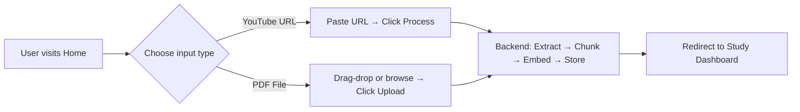
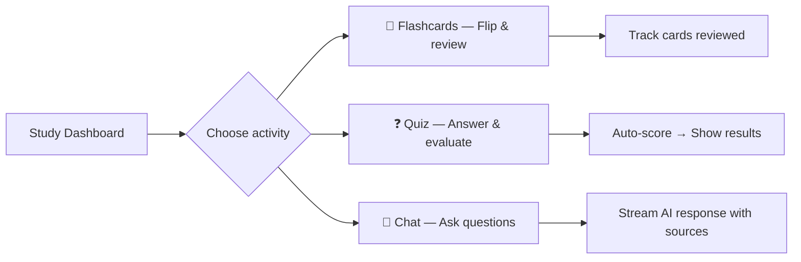
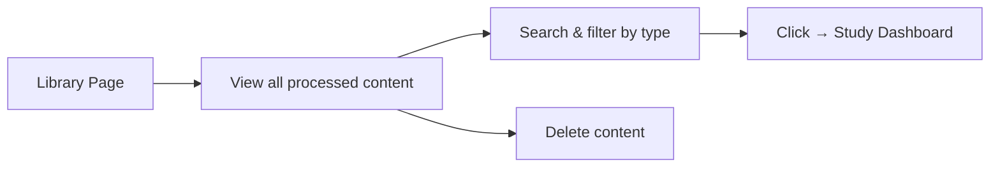
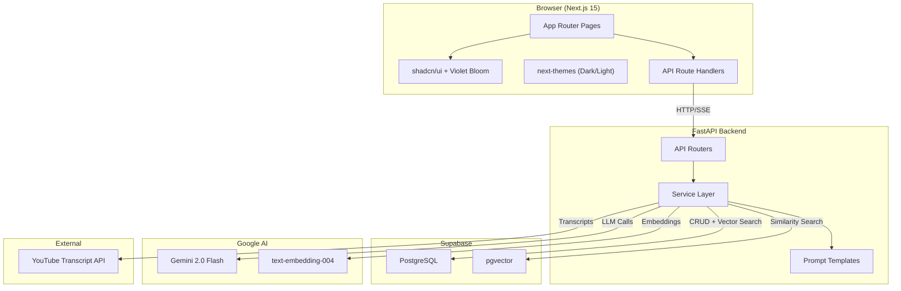
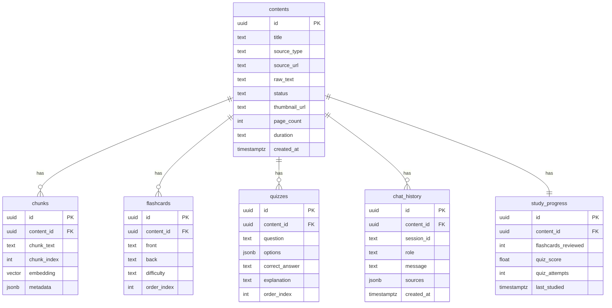

# PocketProfesor — Product Requirements Document (PRD)

**Version:** 1.0
**Date:** February 24, 2026
**Status:** Approved for Development

---

## 1. Executive Summary

**PocketProfesor** is an AI-powered learning assistant that transforms passive content (YouTube videos and PDFs) into active study tools. Users upload a YouTube URL or a PDF document, and the platform automatically processes the content to generate interactive flashcards, multiple-choice quizzes, and a contextual RAG-based chat assistant — enabling deeper understanding and retention of any material.

### Product Vision
> *"Any content, instantly learnable."*

Turn hours of video or pages of documents into structured, interactive learning experiences — powered by AI, designed for speed.

---

## 2. Problem Statement

Students and learners face three key challenges:

| Problem | Impact |
|---------|--------|
| **Passive consumption** | Watching videos or reading PDFs without active recall leads to poor retention |
| **Manual study prep** | Creating flashcards and quiz questions from content is time-consuming |
| **No contextual Q&A** | Learners can't ask follow-up questions about specific content they've consumed |

**PocketProfesor solves all three** by automating study material generation and enabling AI-powered Q&A grounded in the user's own content.

---

## 3. Target Users

| Persona | Description | Primary Use Case |
|---------|-------------|-----------------|
| **University Students** | Studying lecture recordings and textbook PDFs | Generate flashcards from lecture videos for exam prep |
| **Self-Learners** | Learning from YouTube tutorials and online courses | Create structured study materials from unstructured content |
| **Professionals** | Reviewing technical documentation and training materials | Quick comprehension via quiz + chat on internal documents |

---

## 4. Core User Flows

### Flow 1: Content Upload → Processing



### Flow 2: Study Session



### Flow 3: Content Library Management



---

## 5. Functional Requirements

### 5.1 Content Processing

| ID | Requirement | Priority | Acceptance Criteria |
|----|-------------|----------|-------------------|
| CP-1 | Process YouTube video by URL | **Must** | Extract transcript from any video with captions (manual or auto-generated) |
| CP-2 | Process uploaded PDF documents | **Must** | Extract text from multi-page PDFs up to 20MB |
| CP-3 | Chunk content into segments | **Must** | Sentence-aware splitting with 1000-char chunks, 200-char overlap |
| CP-4 | Generate vector embeddings | **Must** | Gemini `text-embedding-004` (768 dimensions) for each chunk |
| CP-5 | Store embeddings in vector DB | **Must** | Supabase pgvector with cosine similarity search |
| CP-6 | Background processing | **Must** | Return immediately, process asynchronously, poll for status |
| CP-7 | Support multiple YouTube URL formats | **Should** | `youtube.com/watch`, `youtu.be`, `youtube.com/embed`, `youtube.com/shorts`, `m.youtube.com` |
| CP-8 | Fallback to auto-generated captions | **Should** | If manual transcript unavailable, use YouTube auto-captions |

### 5.2 Flashcard Generation

| ID | Requirement | Priority | Acceptance Criteria |
|----|-------------|----------|-------------------|
| FC-1 | Generate 10-15 flashcards per content | **Must** | AI produces structured JSON with front/back/difficulty |
| FC-2 | Difficulty levels | **Must** | Each card tagged: easy, medium, or hard |
| FC-3 | 3D flip animation | **Must** | CSS `perspective` + `rotateY` with smooth 0.6s transition |
| FC-4 | Keyboard navigation | **Must** | Arrow keys (prev/next), Space/Enter (flip) |
| FC-5 | Progress tracking | **Must** | Show card position (e.g., "5 / 12") with progress bar |
| FC-6 | Regeneration | **Should** | "Regenerate" button creates fresh flashcards from same content |
| FC-7 | Mobile swipe gestures | **Should** | Touch swipe left/right for navigation on mobile |

**Flashcard Data Schema:**
```json
{
  "flashcards": [
    {
      "id": 1,
      "front": "What is supervised learning?",
      "back": "A machine learning approach where the model learns from labeled training data to make predictions on new data.",
      "difficulty": "medium"
    }
  ]
}
```

### 5.3 Quiz Generation & Evaluation

| ID | Requirement | Priority | Acceptance Criteria |
|----|-------------|----------|-------------------|
| QZ-1 | Generate 5-10 MCQ questions per content | **Must** | 4 options per question, single correct answer |
| QZ-2 | Auto-evaluation on submission | **Must** | Compare answers, calculate score percentage |
| QZ-3 | Instant visual feedback | **Must** | Green (correct) / Red (incorrect) highlight on answer |
| QZ-4 | Explanation per question | **Must** | Show detailed explanation after answering |
| QZ-5 | Final score summary | **Must** | Dialog with score, percentage, and per-question breakdown |
| QZ-6 | Retry quiz | **Should** | Retake same quiz without regeneration |
| QZ-7 | Generate new quiz | **Should** | Create entirely new questions from same content |
| QZ-8 | Study progress update | **Should** | Save best score and attempt count |

**Quiz Data Schema:**
```json
{
  "questions": [
    {
      "id": 1,
      "question": "Which algorithm is most suitable for classification tasks?",
      "options": ["Linear Regression", "Decision Tree", "K-Means Clustering", "PCA"],
      "correct_answer": "Decision Tree",
      "explanation": "Decision Trees are supervised learning algorithms designed for classification and regression tasks..."
    }
  ]
}
```

### 5.4 RAG Chat System

| ID | Requirement | Priority | Acceptance Criteria |
|----|-------------|----------|-------------------|
| CH-1 | Send question and receive AI response | **Must** | Responses grounded in uploaded content via RAG |
| CH-2 | Streaming responses via SSE | **Must** | Text appears token-by-token with typing indicator |
| CH-3 | Source citations | **Must** | Display which content chunks were used for each response |
| CH-4 | Chat history persistence | **Must** | Messages saved to database, loaded on page revisit |
| CH-5 | Context-aware conversation | **Must** | Last 10 messages used as conversation context |
| CH-6 | Clear chat history | **Should** | Delete all messages for a session |
| CH-7 | Markdown rendering | **Should** | AI responses rendered with formatting (bold, lists, code) |
| CH-8 | Auto-scroll | **Should** | Scroll to latest message during streaming |

**RAG Pipeline:**
```
User Query → Generate Query Embedding → Vector Search (top-5 chunks)
→ Assemble Context + Chat History → Gemini Streaming Generation → SSE Response
```

### 5.5 Content Library

| ID | Requirement | Priority | Acceptance Criteria |
|----|-------------|----------|-------------------|
| LB-1 | List all processed content | **Must** | Grid of cards with title, source type, status, date |
| LB-2 | Search by title | **Must** | Real-time filtering as user types |
| LB-3 | Filter by source type | **Must** | Tabs: All / YouTube / PDF |
| LB-4 | Navigate to study dashboard | **Must** | Click card → `/study/[id]` |
| LB-5 | Delete content | **Should** | Remove content + all associated data (cascade) |
| LB-6 | Status polling | **Should** | Auto-update when processing completes |

### 5.6 Study Progress

| ID | Requirement | Priority | Acceptance Criteria |
|----|-------------|----------|-------------------|
| SP-1 | Track flashcards reviewed | **Should** | Count unique cards viewed per content |
| SP-2 | Track quiz scores | **Should** | Store best score and attempt count |
| SP-3 | Display progress on dashboard | **Should** | SVG progress rings for each activity |
| SP-4 | Last studied timestamp | **Should** | Show when user last interacted |

---

## 6. Non-Functional Requirements

### 6.1 Performance

| Metric | Target |
|--------|--------|
| Content processing (YouTube) | < 30 seconds for a 10-min video |
| Content processing (PDF) | < 20 seconds for a 50-page PDF |
| Flashcard/Quiz generation | < 15 seconds |
| Chat response (first token) | < 2 seconds |
| Page load time | < 1.5 seconds |

### 6.2 Reliability

| Requirement | Detail |
|-------------|--------|
| AI retry logic | 3 attempts with exponential backoff on Gemini API failures |
| JSON parse recovery | Extract JSON from malformed AI responses |
| Stream disconnection | Auto-reconnect once on SSE stream failure |
| Network errors | Retry with backoff for 5xx errors (2 retries) |

### 6.3 Scalability

| Aspect | Approach |
|--------|----------|
| Embedding batching | Process chunks in batches of 20 with 100ms delay |
| Database indexing | IVFFlat index on vector column for fast similarity search |
| Async processing | Background tasks for content processing (non-blocking) |

### 6.4 Security

| Aspect | Approach |
|--------|----------|
| API keys | Server-side only (never exposed to client) |
| CORS | Restricted to frontend origin |
| File validation | Server-side PDF validation (size, format, content) |
| Input sanitization | Pydantic validation on all API inputs |

---

## 7. System Architecture



---

## 8. Tech Stack

| Layer | Technology | Version |
|-------|-----------|---------|
| Frontend Framework | Next.js (App Router) | 15 |
| Language | TypeScript | 5+ |
| Styling | TailwindCSS | 3+ |
| UI Components | shadcn/ui | Latest |
| Theme | Violet Bloom (TweakCN) | — |
| Icons | Lucide React | Latest |
| Theme Toggle | next-themes | Latest |
| Toasts | Sonner | Latest |
| Backend Framework | FastAPI | 0.115+ |
| Language | Python | 3.11+ |
| Database | PostgreSQL (Supabase) | 15+ |
| Vector Store | pgvector | 0.5+ |
| AI Model (LLM) | Google Gemini 2.0 Flash | Latest |
| AI Model (Embeddings) | text-embedding-004 | 768 dims |
| PDF Parsing | PyMuPDF (fitz) | 1.24+ |
| YouTube Transcripts | youtube-transcript-api | 0.6+ |
| Streaming | SSE (sse-starlette) | 2.1+ |

---

## 9. API Specification

### 9.1 Endpoints

| Method | Path | Description | Request Body | Response |
|--------|------|-------------|-------------|----------|
| `GET` | `/health` | Health check | — | `{ status, version }` |
| `POST` | `/process-video` | Process YouTube video | `{ url }` | `{ content_id, title, status }` |
| `POST` | `/process-pdf` | Process PDF upload | `multipart/form-data` | `{ content_id, title, status }` |
| `GET` | `/contents` | List all content | — | `{ contents: [...] }` |
| `GET` | `/contents/{id}` | Get content detail | — | `Content` object |
| `DELETE` | `/contents/{id}` | Delete content | — | `{ status: "deleted" }` |
| `POST` | `/generate-flashcards` | Generate flashcards | `{ content_id }` | `{ flashcards: [...] }` |
| `GET` | `/flashcards/{id}` | Get flashcards | — | `{ flashcards: [...] }` |
| `POST` | `/generate-quiz` | Generate quiz | `{ content_id }` | `{ questions: [...] }` |
| `GET` | `/quiz/{id}` | Get quiz | — | `{ questions: [...] }` |
| `POST` | `/quiz/evaluate` | Evaluate answers | `{ content_id, answers }` | `{ score, total, percentage, results }` |
| `POST` | `/chat` | RAG chat (SSE) | `{ content_id, message, session_id }` | SSE stream |
| `GET` | `/chat/history/{id}` | Get chat history | — | `{ messages: [...] }` |
| `DELETE` | `/chat/history/{id}` | Clear chat | — | `{ status: "cleared" }` |

### 9.2 Error Response Format
```json
{
  "detail": "Human-readable error message",
  "error_code": "INVALID_URL | FILE_TOO_LARGE | NO_TRANSCRIPT | CONTENT_NOT_FOUND | GENERATION_FAILED"
}
```

---

## 10. Database Schema

Six tables with pgvector extension enabled:



---

## 11. UI/UX Specifications

### 11.1 Design System

| Property | Value |
|----------|-------|
| **Theme** | Violet Bloom (TweakCN) |
| **Default Mode** | Dark |
| **Primary Color** | `#8c5cff` (dark) / `#7033ff` (light) |
| **Font** | Plus Jakarta Sans (300–800 weights) |
| **Border Radius** | 1.4rem (rounded, modern) |
| **Effects** | Glassmorphism (`backdrop-filter: blur`), gradient glows, glow borders |
| **Transitions** | 300ms ease on all hover/interactive states |
| **Icons** | Lucide React |

### 11.2 shadcn/ui Components Used (18 total)

`button` · `card` · `input` · `badge` · `progress` · `skeleton` · `dialog` · `separator` · `tooltip` · `tabs` · `scroll-area` · `radio-group` · `alert` · `avatar` · `sheet` · `carousel` · `sidebar` · `sonner`

### 11.3 Pages

| Route | Page | Key Features |
|-------|------|-------------|
| `/` | Home / Upload | Hero gradient, YouTube URL card, PDF drop zone, recent uploads |
| `/library` | Content Library | Searchable grid, type tabs, status badges, delete |
| `/study/[id]` | Study Dashboard | Content overview, progress rings, 3 action cards |
| `/study/[id]/flashcards` | Flashcard Viewer | 3D flip, keyboard nav, swipe, difficulty badges |
| `/study/[id]/quiz` | Quiz Interface | 1-per-screen MCQ, instant feedback, score dialog |
| `/study/[id]/chat` | RAG Chat | Streaming bubbles, source chips, history panel |

### 11.4 Responsive Breakpoints

| Breakpoint | Layout |
|-----------|--------|
| < 768px (Mobile) | Sidebar hidden, single column, full-width cards |
| 768–1024px (Tablet) | Sidebar collapsed (icons), 2-column grid |
| > 1024px (Desktop) | Sidebar expanded, 3-column grid |

---

## 12. Implementation Phases

| Phase | Focus | Key Deliverables |
|-------|-------|-----------------|
| **Phase 1** | Scaffolding | Next.js + FastAPI + Supabase schema + shadcn/ui + theme toggle |
| **Phase 2** | Content Processing | YouTube/PDF extraction + chunking + Gemini embeddings + pgvector |
| **Phase 3** | AI Features | Flashcard/quiz generation + RAG chat with SSE streaming |
| **Phase 4** | Frontend UI | All 6 pages with shadcn components + animations |
| **Phase 5** | Integration & Polish | API wiring + progress tracking + keyboard/swipe + error handling |
| **Phase 6** | Documentation & QA | README + API docs + tests + browser E2E verification |

> Detailed step-by-step guides for each phase are available in `phases/phase1-6*.md`.

---

## 13. Success Metrics

| Metric | Target |
|--------|--------|
| YouTube processing success rate | > 95% (for videos with captions) |
| PDF processing success rate | > 99% (for valid text-based PDFs) |
| Flashcard quality | AI produces correctly formatted JSON 100% of time (with retry) |
| Quiz answer accuracy | Correct answer matches explanation in 100% of cases |
| Chat relevance | RAG responses grounded in source content (verifiable via citations) |
| UI responsiveness | All pages functional on mobile, tablet, and desktop |
| Theme toggle | Both dark and light modes render correctly on all pages |

---

## 14. Risks & Mitigations

| Risk | Impact | Mitigation |
|------|--------|-----------|
| YouTube video has no captions | Can't process video | Clear error message + suggest videos with captions |
| Gemini API rate limits | Slow/failed generation | Exponential backoff retry (3 attempts), batch embeddings |
| Malformed AI JSON output | Parse failure | JSON extraction from raw text, retry with rephrased prompt |
| Large PDFs (high chunk count) | Slow embedding | Batch processing (20/batch), background task |
| SSE stream disconnection | Incomplete chat response | Client-side reconnection, save partial response |
| pgvector index cold start | Slow first query | IVFFlat index with 100 lists, pre-warm on first content |

---

## 15. Future Enhancements (Out of Scope for v1)

| Feature | Description |
|---------|-------------|
| User authentication | Multi-user support with Supabase Auth |
| Spaced repetition | SM-2 algorithm for flashcard review scheduling |
| Export to Anki | Export flashcards as `.apkg` for Anki import |
| Content sharing | Share study materials via public links |
| multi-language support | Process and generate content in non-English languages |
| Audio/Video summaries | AI-generated summary recordings |
| Collaborative study | Real-time multiplayer quiz sessions |

---

## Appendix A: Environment Variables

| Variable | Service | Description |
|----------|---------|-------------|
| `GEMINI_API_KEY` | Backend | Google Gemini API key |
| `SUPABASE_URL` | Backend | Supabase project URL |
| `SUPABASE_SERVICE_KEY` | Backend | Supabase service role key |
| `FRONTEND_URL` | Backend | CORS allowed origin |
| `EMBEDDING_MODEL` | Backend | `models/text-embedding-004` |
| `LLM_MODEL` | Backend | `models/gemini-2.0-flash` |
| `NEXT_PUBLIC_API_URL` | Frontend | API base URL for client |
| `BACKEND_URL` | Frontend | Backend URL for proxy routes |
