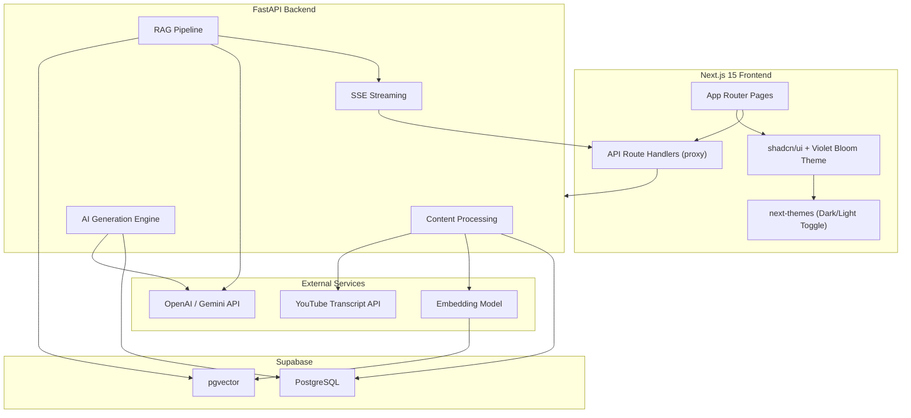

# AI Learning Assistant — Implementation Plan

An AI-powered learning platform where users input a YouTube URL or upload a PDF. The system processes content, generates flashcards & quizzes, and enables RAG-powered contextual chat — all wrapped in a premium, responsive UI built with **shadcn/ui** and a toggleable dark/light theme.

---

## System Architecture



---

## User Review Required

> [!IMPORTANT]
> **AI Model Choice**: The plan uses **OpenAI (GPT-4.1 + text-embedding-3-small)** as the primary AI provider. If you prefer **Gemini**, I can swap — the architecture supports both via an abstraction layer.

> [!IMPORTANT]
> **Theme Choice**: I'm recommending the **Violet Bloom** theme from TweakCN — it has a stunning dark mode with violet accents (`#8c5cff`), modern rounded corners (`1.4rem`), and ships with **Plus Jakarta Sans** font. Both light and dark modes look premium. If you prefer a different theme (Cosmic Night, Graphite, etc.), let me know.

> [!WARNING]
> **API Keys Required** before execution: OpenAI API key (or Gemini) + Supabase project URL & service role key.

---

## Project Directory Structure

```
c:\Assigment\Learning Platform\
├── frontend/                          # Next.js 15 App
│   ├── public/
│   ├── src/
│   │   ├── app/
│   │   │   ├── layout.tsx             # Root layout — ThemeProvider + SidebarProvider
│   │   │   ├── page.tsx               # Home / Upload page
│   │   │   ├── globals.css            # Violet Bloom theme vars + glassmorphism utils
│   │   │   ├── library/
│   │   │   │   └── page.tsx           # Content library
│   │   │   ├── study/[id]/
│   │   │   │   ├── page.tsx           # Study dashboard
│   │   │   │   ├── flashcards/page.tsx
│   │   │   │   ├── quiz/page.tsx
│   │   │   │   └── chat/page.tsx
│   │   │   └── api/                   # Next.js API route proxies
│   │   │       ├── process-video/route.ts
│   │   │       ├── process-pdf/route.ts
│   │   │       ├── generate-flashcards/route.ts
│   │   │       ├── generate-quiz/route.ts
│   │   │       └── chat/route.ts
│   │   ├── components/
│   │   │   ├── ui/                    # shadcn/ui primitives (installed)
│   │   │   ├── layout/
│   │   │   │   ├── app-sidebar.tsx    # shadcn Sidebar preset
│   │   │   │   ├── header.tsx         # Top bar with theme toggle
│   │   │   │   └── theme-toggle.tsx   # Moon/Sun icon button
│   │   │   ├── providers/
│   │   │   │   └── theme-provider.tsx # next-themes wrapper
│   │   │   ├── upload/
│   │   │   ├── flashcard/
│   │   │   ├── quiz/
│   │   │   └── chat/
│   │   ├── lib/
│   │   │   ├── api.ts
│   │   │   └── utils.ts              # cn() utility
│   │   └── types/
│   │       └── index.ts
│   ├── components.json                # shadcn/ui config
│   ├── tailwind.config.ts
│   ├── next.config.mjs
│   └── package.json
│
├── backend/                           # FastAPI Backend (unchanged from v1)
│   ├── app/
│   │   ├── main.py
│   │   ├── config.py
│   │   ├── database.py
│   │   ├── models/
│   │   │   ├── schemas.py
│   │   │   └── database.py
│   │   ├── routers/
│   │   │   ├── content.py
│   │   │   ├── flashcards.py
│   │   │   ├── quiz.py
│   │   │   └── chat.py
│   │   ├── services/
│   │   │   ├── youtube_service.py
│   │   │   ├── pdf_service.py
│   │   │   ├── chunking_service.py
│   │   │   ├── embedding_service.py
│   │   │   ├── vector_store.py
│   │   │   ├── ai_service.py
│   │   │   └── rag_service.py
│   │   └── prompts/
│   │       ├── flashcard_prompt.py
│   │       ├── quiz_prompt.py
│   │       └── chat_prompt.py
│   ├── requirements.txt
│   └── .env.example
│
├── .env.example
└── README.md
```

---

## Proposed Changes

### Component 1: Theme System & Design Tokens

#### Theme: **Violet Bloom** (via TweakCN)

Applied via `globals.css` with CSS custom properties. Both modes are fully designed:

| Token | Light Mode | Dark Mode |
|-------|-----------|-----------|
| Background | `#fdfdfd` | `#1a1b1e` |
| Foreground | `#000000` | `#f0f0f0` |
| Primary | `#7033ff` (Violet) | `#8c5cff` (Lighter violet) |
| Card | `#fdfdfd` | `#222327` |
| Muted | `#f5f5f5` | `#2a2c33` |
| Border | `#e7e7ee` | `#33353a` |
| Border Radius | `1.4rem` | `1.4rem` |
| Font | Plus Jakarta Sans | Plus Jakarta Sans |

#### Glassmorphism Design Utilities (Custom CSS)

```css
/* Added to globals.css alongside Violet Bloom tokens */
.glass         { backdrop-filter: blur(12px); background: hsl(var(--card) / 0.6); border: 1px solid hsl(var(--border) / 0.3); }
.glass-strong  { backdrop-filter: blur(20px); background: hsl(var(--card) / 0.8); }
.gradient-glow { background: linear-gradient(135deg, hsl(var(--primary) / 0.15), hsl(var(--accent) / 0.1)); }
.glow-border   { box-shadow: 0 0 20px hsl(var(--primary) / 0.15); }
```

#### [NEW] [theme-provider.tsx](file:///c:/Assigment/Learning%20Platform/frontend/src/components/providers/theme-provider.tsx)
- Wraps app with `next-themes` `ThemeProvider`
- `attribute="class"` strategy for TailwindCSS `dark:` classes
- `defaultTheme="dark"` (premium feel on first visit)
- `enableSystem` to respect OS preference

#### [NEW] [theme-toggle.tsx](file:///c:/Assigment/Learning%20Platform/frontend/src/components/layout/theme-toggle.tsx)
- Uses shadcn `Button` (variant `ghost`, size `icon`)
- `Sun` / `Moon` icons from `lucide-react`
- Smooth rotation animation on toggle
- Placed in the header bar, always accessible

---

### Component 2: shadcn/ui Component Mapping Per Page

Below is a complete mapping of which shadcn/ui components are used on each page:

#### App Shell (Root Layout)

| shadcn Component | Usage |
|-----------------|-------|
| **Sidebar** | Main navigation — collapsible, with SidebarHeader, SidebarContent, SidebarMenu, SidebarFooter |
| **SidebarProvider** | Wraps app for sidebar state management |
| **SidebarTrigger** | Menu button to toggle sidebar |
| **Button** | Theme toggle, CTAs throughout |
| **Separator** | Visual dividers in sidebar sections |
| **Tooltip** | Icon-only tooltips when sidebar is collapsed |
| **Sonner** (Toaster) | Global toast notifications for success/error |

#### Home / Upload Page

| shadcn Component | Usage |
|-----------------|-------|
| **Card** (CardHeader, CardContent, CardFooter) | Two cards — "YouTube URL" and "Upload PDF" |
| **Input** | YouTube URL text input |
| **Button** | "Process Video", "Upload PDF" actions |
| **Badge** | Source type labels (YouTube / PDF) |
| **Progress** | Processing progress bar during content extraction |
| **Skeleton** | Loading state while processing |
| **Dialog** | Processing status modal with step-by-step updates |

#### Content Library Page

| shadcn Component | Usage |
|-----------------|-------|
| **Card** | Content item cards in grid layout |
| **Badge** | Source type (YouTube/PDF), status (Processing/Ready) |
| **Input** | Search bar to filter content |
| **Tabs** (TabsList, TabsTrigger) | Filter: All / YouTube / PDF |
| **Skeleton** | Loading skeleton grid |
| **ScrollArea** | Scrollable content grid |

#### Study Dashboard (`/study/[id]`)

| shadcn Component | Usage |
|-----------------|-------|
| **Card** | Three action cards (Flashcards, Quiz, Chat) + content overview |
| **Badge** | Difficulty level, question count |
| **Progress** | Study completion ring (custom SVG + progress value) |
| **Button** | "Start Flashcards", "Take Quiz", "Open Chat" |
| **Separator** | Between content summary and actions |

#### Flashcard Viewer

| shadcn Component | Usage |
|-----------------|-------|
| **Card** | Flashcard container (with CSS 3D flip transform) |
| **Button** | Prev / Next / Flip / Regenerate |
| **Progress** | Card position in deck (e.g., "5 / 15") |
| **Badge** | Difficulty tag (Easy / Medium / Hard) |
| **Tooltip** | Keyboard shortcut hints |
| **Carousel** | Alternative navigation mode (swipe on mobile) |

#### Quiz Interface

| shadcn Component | Usage |
|-----------------|-------|
| **Card** | Question card container |
| **RadioGroup** + **RadioGroupItem** | MCQ answer options |
| **Button** | "Submit Answer", "Next Question", "Retry Quiz" |
| **Progress** | Quiz progress (question X of Y) |
| **Badge** | Correct/Incorrect answer status |
| **Alert** | Explanation reveal after answering |
| **Dialog** | Final score summary modal with breakdown |

#### RAG Chat Interface

| shadcn Component | Usage |
|-----------------|-------|
| **Card** | Chat container |
| **Input** | Message input field |
| **Button** | Send button + clear history |
| **ScrollArea** | Scrollable message list |
| **Avatar** | User and AI avatar indicators |
| **Badge** | Source citation chips on AI responses |
| **Skeleton** | Typing/loading indicator |
| **Sheet** | Slide-out panel for chat history |
| **Separator** | Between messages |

---

### Component 3: Database Schema (Supabase)

Six core tables with pgvector extension:

| Table | Purpose | Key Columns |
|-------|---------|-------------|
| `contents` | Processed YouTube/PDF metadata | `id`, `title`, `source_type`, `source_url`, `raw_text`, `status`, `created_at` |
| `chunks` | Text chunks with embeddings | `id`, `content_id`, `chunk_text`, `chunk_index`, `embedding` (vector 1536), `metadata` |
| `flashcards` | Generated flashcard sets | `id`, `content_id`, `front`, `back`, `difficulty`, `order_index` |
| `quizzes` | Quiz question sets | `id`, `content_id`, `question`, `options` (JSONB), `correct_answer`, `explanation` |
| `chat_history` | Conversation messages | `id`, `content_id`, `session_id`, `role`, `message`, `created_at` |
| `study_progress` | User progress tracking | `id`, `content_id`, `flashcards_reviewed`, `quiz_score`, `quiz_attempts`, `last_studied` |

Vector similarity search function:
```sql
CREATE OR REPLACE FUNCTION match_chunks(
  query_embedding vector(1536),
  match_count int DEFAULT 5,
  filter_content_id uuid DEFAULT NULL
)
RETURNS TABLE (id uuid, chunk_text text, similarity float)
```

---

### Component 4: FastAPI Backend

#### API Endpoints

| Endpoint | Method | Description |
|----------|--------|-------------|
| `/health` | GET | Health check |
| `/process-video` | POST | YouTube URL → transcript → chunk → embed → store |
| `/process-pdf` | POST | PDF upload → extract → chunk → embed → store |
| `/contents` | GET | List all processed content |
| `/contents/{id}` | GET | Single content details |
| `/contents/{id}` | DELETE | Delete content + associated data |
| `/generate-flashcards` | POST | Generate 10-15 flashcards from content |
| `/flashcards/{content_id}` | GET | Retrieve saved flashcards |
| `/generate-quiz` | POST | Generate 5-10 MCQs with explanations |
| `/quiz/{content_id}` | GET | Retrieve saved quiz |
| `/quiz/evaluate` | POST | Auto-evaluate answers → score + feedback |
| `/chat` | POST | RAG chat with SSE streaming |
| `/chat/history/{content_id}` | GET | Chat history for content |
| `/chat/history/{session_id}` | DELETE | Clear chat history |

#### Backend Services

| Service | Responsibility |
|---------|---------------|
| `youtube_service.py` | Extract transcripts via `youtube-transcript-api`, handle URL parsing |
| `pdf_service.py` | Parse PDFs with `PyMuPDF`, 20MB limit, page-level metadata |
| `chunking_service.py` | Recursive sentence-aware splitter (chunk_size=1000, overlap=200) |
| `embedding_service.py` | Batch embeddings with rate limiting + retry logic |
| `vector_store.py` | Supabase pgvector CRUD + semantic similarity search |
| `ai_service.py` | Centralized LLM calls with structured JSON parsing + retry |
| `rag_service.py` | Full pipeline: query → embed → retrieve → rerank → stream generate |

---

## Enhanced Features

| Feature | Description |
|---------|-------------|
| **Theme Toggle** | Dark/Light switch with `next-themes`, smooth transitions |
| **Glassmorphism** | Frosted glass cards with `backdrop-filter: blur()` |
| **Study Progress** | Track flashcards reviewed, quiz scores, study streaks |
| **Difficulty Levels** | Flashcards tagged easy/medium/hard |
| **Quiz Explanations** | Detailed explanation per answer |
| **Source Citations** | Chat responses cite specific content chunks |
| **Keyboard Navigation** | Arrow keys for flashcards, Enter for quiz |
| **Mobile Gestures** | Swipe for flashcard navigation |
| **Content Search** | Search across all processed content |
| **Regeneration** | Re-generate flashcards or quiz for same content |

---

## Error Handling Strategy

| Layer | Approach |
|-------|----------|
| **API Validation** | Pydantic models → 422 with field-level errors |
| **Content Processing** | Specific error types (invalid URL, no transcript, corrupt PDF) |
| **AI Calls** | Retry with exponential backoff (3 attempts) + JSON parse fallback |
| **Frontend** | shadcn `Sonner` toasts for errors, `Skeleton` for loading, inline validation |
| **Network** | Timeout handling (30s processing, 60s generation), connection recovery |

---

## Verification Plan

### Automated Tests
```bash
# Backend
cd backend && pip install pytest pytest-asyncio httpx && pytest tests/ -v
```

### Browser Verification
1. **Upload Flow**: Home → paste YouTube URL → verify processing → redirect to study page
2. **PDF Upload**: Drag-drop PDF → verify extraction → content in library
3. **Theme Toggle**: Click toggle → verify all pages switch between dark/light correctly
4. **Flashcards**: Verify flip animation, keyboard nav, progress bar
5. **Quiz**: Answer questions → verify feedback colors → check final score dialog
6. **Chat**: Send question → verify streaming response → source citation badges
7. **Responsive**: Resize to mobile → sidebar collapses → all pages usable
8. **Glassmorphism**: Verify frosted glass effects on cards in both themes
